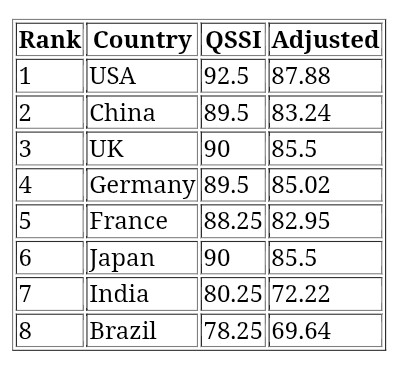

# QSSI™ — Quantum Sovereign Security Index System

---

## Overview

QSSI™ is a sovereign-grade global security intelligence platform designed to compute, rank, and visualize national security performance across countries using a structured index model.

---

## System Architecture

- Dataset Layer → Global QSSI dataset
- Engine Layer → Scoring & ranking computation
- API Layer → Data access & execution
- Dashboard → Live visualization interface
- Reports → Policy-grade analytical outputs

---

## Live Dashboard

👉 https://bidyutmazumdar.github.io/QVP-Global-System/

---

## Core Use Cases

- National security benchmarking
- Defence and risk assessment
- Strategic intelligence modeling
- Global security ranking system

---

## Institutional Relevance

Applicable for:

- Government Policy Systems
- Defence Ministries
- International Organizations
- Strategic Think Tanks

---

## Licensing Model

- Country License (Sovereign Deployment)
- Institutional License
- API Subscription Model

---

## Research & Publication

Zenodo DOI: https://doi.org/10.5281/zenodo.19298458

---

## System Positioning

QSSI™ is designed as a deployable sovereign intelligence infrastructure for national governments, enabling real-time security benchmarking, policy evaluation, and strategic decision-making.

---

## 👤 Author

Dr. B. Mazumdar  
Architect of Sovereign AI Infrastructure Systems  
Founder, FAIR+D Canon™

---

© 2026 QSSI™ Framework
